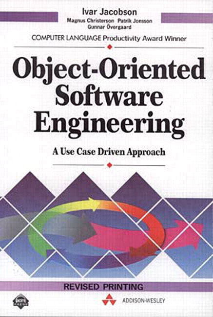

# An Introduction...

## ...to Object-Oriented Programming, Design Patterns, and Test-Driven Development

###### By Jack Lenox ( [WordPress.com VIP](https://vip.wordpress.com/) )

---

## Slides are available at:
### github.com/jacklenox/introduction-to-oop

---

# Introducing the introduction

## What is Object-Oriented Programming?

---

> "Object-oriented programming (OOP) is a programming paradigm based on the concept of "objects", which may contain data, in the form of fields, often known as attributes; and code, in the form of procedures, often known as methods."

###### Wikipedia

---

# <center></center>

---

# <center></center>

---

- C++
- Delphi
- Objective-C
- Java
- C#
- .NET
- Ruby

---

# PHP 5 (July 2006)

---

# WordPress Est. 2003

---

# So, what is not OOP?

---

# "Normal" PHP tends to come under the banner of Procedural Programming

---

# Procedural Programming

- Linear
- Written in the order it's executed
- Not necessarily modular

---

# Procedural Form Submission

```php
<?php
if ( isset( $_POST['name'] ) ) {
    
    $name = sanitize_text_field( $_POST['name'] );
    
    if ( strlen( $name ) < 6 ) {
    	echo 'Name not long enough';
        exit;
    }
}
?>

// Form input etc.
```

---

# Object-Oriented Programming

- Non-linear
- Series of self-contained objects that can work together
- Modular by design

---

# Benefits

- Reduced possibility of naming clashes
- Modularity
- Reusability

---

# Why and when to OOP?

---

# 

---

# Car

## Attributes:

- Colour: Yellow
- Doors: 2
- Luggage rack: true

## Methods:

- Accelerate
- Brake
- Steer

---

# Blog post

## Attributes:

- Title: My awesome blog post!
- Date: 2016-09-06
- Sticky: false

## Methods:

- Update
- Publish
- Delete

---

# How to OOP?

---

# Language

- Classes
- Attributes
- Methods
- `private`, `protected`, `public`

---

# Class

```php
class Car {
    // Class body
}
```

---

# A class is a blueprint for the objects that we want to produce

---

# Attributes

```php
class Car {
    public $color;
    public $doors;
    public $luggage_rack;
}
```

---

# Methods

```php
class Car {
    function accelerate() {
    	echo 'Tyre squeal!';
    }
    
    function brake() {
        echo 'Screech';
    }
    
    function steer( $degree ) {
        echo "Steer by $degree degrees";
    }
}
```

---

# Car Factory

```php
class Car {
    public $color = 'white';
    public $doors = 2;
    public $luggage_rack = false;
    
    function accelerate() {
    	echo 'Tyre squeal!';
    }
    
    function brake() {
        echo 'Screech';
    }
    
    function steer( $degree ) {
        echo "Steer by $degree degrees";
    }
}
```

---

# Build a Car

```php
$new_car = new Car();
```

---

# Build a Yellow Car with Two Doors

```php
$yellow_car = new Car();
$yellow_car->color = "yellow";
$yellow_car->doors = 4;
```

---

# Could Do Better?

---

# Introducing `__construct`

```php
class Car {
    public $color;
    public $doors;
    public $luggage_rack;
    
    function __construct( $color,
                          $doors, $luggage_rack ) {
        $this->color = $color;
        $this->doors = $doors;
        $this->luggage_rack = $luggage_rack;
    }
    
    // Methods go here
}

```

---

# Build a Purple Car with Four Doors and a Luggage Rack

```php
$purple_car = new Car( 'purple', 4, true );
```

---

# Documentation

## Say hello to phpDocumentor

---

# Documenting Classes

```php
/**
 * Defines car factory.
 * The car class produces cars
 *
 * @package car
 * @author Jack Lenox
 * @copyright 2016 Automattic Inc.
 */
class Car {
    // Class body
}
```

---

# Documenting Properties

```php
class Car {
    /**
     * The car color.
     * Used by the manufacturing process
     * @var string
     */
    public $color;
    
    /**
     * The number of doors.
     * Also used by the manufacturing process
     * @var integer
     */
    public $doors;
    
    /**
     * Whether or not the car has a luggage ruck.
     * You've guessed it, also for manufacturing
     * @var bool
     */
    public $luggage_rack;
    // ...
```

---

# Documenting Methods

```php
    // ...
    
    /**
     * Accelerate to move the car forwards.
     * Acceleration is currently not variable so this
     * method will return a squeal from the tyres as
     * the wheels spin.
     * @return string
     */
    function accelerate() {
        return 'Tyre squeal!';
    }
    
    // ...
```

---

# Unit Testing and Test-Driven Development

## Say hello to PHPUnit

---

# A Basic Test

```php
use PHPUnit\Framework\TestCase;

require_once( 'class-car.php' );

class CarTest extends TestCase {
    private $car;
    
    public function setUp() {
        $this->car = new Car( 'yellow', 4, true );
    }
    
    public function tearDown() {
    }
    
    public function testGetCar() {
        $this->assertEquals( $this->car->color,
                             'yellow' );
        $this->assertEquals( $this->car->doors, 4 );
        $this->assertTrue( $this->car->luggage_rack );
    }
}
```

---

# Run the Test

```bash
$ phpunit --verbose tests
```

```bash
PHPUnit 5.5.4 by Sebastian Bergmann and contributors.

Runtime:       PHP 7.0.8-0ubuntu0.16.04.2

.                                          1 / 1 (100%)

Time: 105 ms, Memory: 8.00MB

OK (1 test, 3 assertions)

```

---

# Design Patterns

---

# Singletons and Inheritance

---

# OOP and WP in Practice

- Widgets API
- The Walker Class
- WP_Rewrite

---

# Widgets API

```php
class My_Widget extends WP_Widget {

	/**
	 * Sets up the widgets name etc
	 */
	public function __construct() {
		$widget_ops = array( 
			'classname' => 'my_widget',
			'description' => 'My Widget
                                         is awesome',
		);
		parent::__construct( 'my_widget',
                             'My Widget',$widget_ops );
	}
    
    /// Continues...
```

---

```php

	/**
	 * Outputs the content of the widget
	 *
	 * @param array $args
	 * @param array $instance
	 */
	public function widget( $args, $instance ) {
		// outputs the content of the widget
	}

	/**
	 * Outputs the options form on admin
	 *
	 * @param array $instance The widget options
	 */
	public function form( $instance ) {
		// outputs the options form on admin
	}
```

---

```php
	/**
	 * Processing widget options on save
	 *
	 * @param array $new_instance The new
	 * options
	 * @param array $old_instance The previous 
	 * options
	 */
	public function update( $new_instance,
                            $old_instance ) {
		// processes widget options to be saved
	}
}
```

---

# The Walker Class

## ( code.tutsplus.com/tutorials/understanding-the-walker-class--wp-25401 )

---

# Conclusion

---

# WPPB ( wppb.me )
# Tom McFarlin's Tuts+ Series<br>( tommcfarlin.com/object-oriented-programming-in-wordpress/ )

---

# When not to OOP?

---

# Trouser-Oriented Clothing, Noun-Oriented Language etc.

---

# Functional Programming?

## Execution in the Kingdom of Nouns<br>( steve-yegge.blogspot.sg/2006/03/execution-in-kingdom-of-nouns.html )

---

# OOP is not necessarily the "right way"

---

# But it's much better than this!

## 

---

## Thank you :heart:

### github.com/jacklenox/introduction-to-oop

### automattic.com/work-with-us/